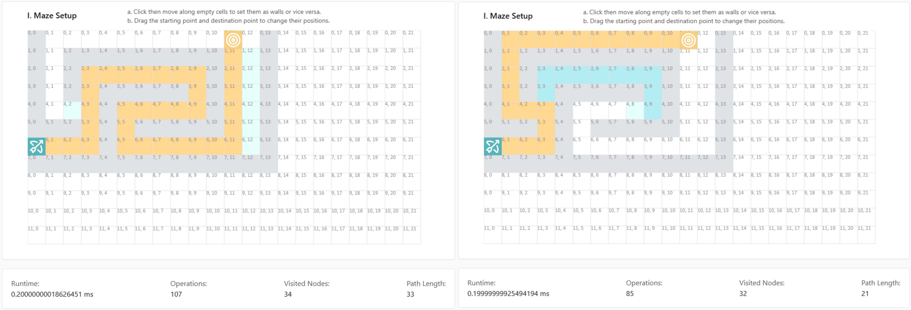

# Path-Finding Algorithm Visualizer
An interactive canvas-based tool designed to visualize the mechanics and efficiency of classic search algorithms on a 2D grid.

[Live Demo](https://path-finding-algorithm-visualizer-gamma.vercel.app/)

## 🎓 Motivation
This project was inspired by Harvard’s [CS50 Introduction to Artificial Intelligence with Python](https://cs50.harvard.edu/ai/), specifically the lecture on [Search](https://cs50.harvard.edu/ai/weeks/0/). I wanted to translate the abstract concepts of frontier expansion and heuristic-based search (A*) into a tangible, interactive frontend experience to experimentally evaluate algorithmic tradeoffs between optimality, exploration cost, and heuristic guidance in real time.

## 🛠 Core Functionality
* **Search Suite**: Implements Breadth-First Search (BFS), Depth-First Search (DFS), Greedy Best-First Search, and A* Search, supporting bi-directional and heuristics settings.

* **Interactive Environment**: Allows users to dynamically place obstacles, adjust start/destination nodes, modify playback speed and choose running mode(continuously or step-by-step) to observe how different algorithms navigate constraints.

* **Technical Log**: Features a real-time monitor that tracks Runtime, Operations Count, Visited Nodes, and Path Length, providing empirical data to support theoretical complexity analysis.

* **Algorithm Learning**: Introduces each algorithm briefly and supports algorithm comparisons(WIP) in terms of complexity and path length through various sample maze setups.

## 🏗 Engineering Challenges & Optimization
* **Performance via Decoupling**: To maintain a responsive 60 FPS UI, I decoupled the search execution from the animation. The algorithm pre-calculates the result and logs state changes into a steps array. These are then rendered using requestAnimationFrame, preventing the main thread from blocking during heavy computation on large grids.
* **Advanced Informed Search**: Implemented an extensible AStarMaze class supporting:
    * Bi-directional Search: Significantly reduces the search space by expanding frontiers from both the start and goal nodes simultaneously.
    * Multiple Heuristic Metrics: Optimized for different movement constraints using Manhattan, Euclidean, Octile, and Chebyshev distances.
* **Frontier Management**: Utilized a prioritized frontier approach where nodes are dynamically sorted to maintain $O(\log n)$ efficiency (simulating a Priority Queue) for both A* ($f = g + h$) and Greedy Best-First Search ($f = h$).

* **State Management**: Leveraged Zustand for atomic state updates. By mapping the algorithm's "steps" to React state, I ensured that only the specific grid cells being explored or updated trigger a re-render, rather than the entire grid.

## 🔬 Empirical Analysis: Greedy Best-First vs. A*

The visualizer serves as an experimental testbed to evaluate the trade-offs between exploration efficiency and path optimality.

Below is a controlled comparison between Greedy Best-First Search and A* on the same maze configuration.

**Key Observations:**
- Optimality vs. Greediness: Greedy Best-First Search (GBFS) prioritizes the local heuristic ($h(n)$), leading to faster target acquisition but often resulting in suboptimal, "jagged" paths. In contrast, A* maintains optimality by balancing local greed with cumulative path cost ($g(n)$).
- Search Space Complexity: While A* guarantees the shortest path, it typically expands a larger frontier in the middle of the search. GBFS minimizes the search space at the expense of accuracy.
- Heuristic Impact: The comparison demonstrates that while both algorithms utilize heuristics to guide the search, only A* satisfies the condition for admissibility required to guarantee the shortest path in a 2D grid.

## 💻 Tech Stack

* **Framework**: [Next.js (App Router)](https://nextjs.org), React, zustand, Konva

* **Language**: TypeScript

* **Styling**: Tailwind CSS

* **Deployment**: Vercel

## 🔮 Future Improvements

* Current implementation uses Array.sort() for the frontier ($O(n \log n)$). A future optimization involves implementing a true Binary Heap to achieve $O(\log n)$ insertions, further optimizing performance for high-density mazes.

